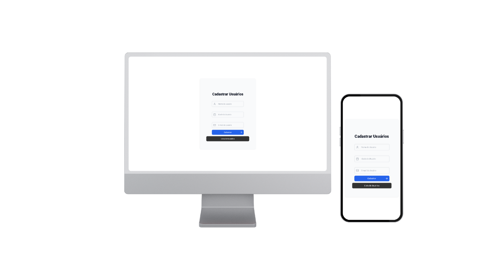

## CADASTRO DE USUÁRIOS
 

## DESENVOLVIDO REACT | JAVASCRIPT.

Este Cadastro de Usuários foi feito com um design simples, porém muito eficiente e moderno. Desenvolvi a interface utilizando React e, para a estilização, optei pela biblioteca Styled Components, que me permitiu criar um código mais modular e fácil de manter.

No back-end, utilizei o MongoDB como banco de dados e o Prisma para gerenciar a camada de dados de forma eficiente e segura. A combinação dessas tecnologias me permitiu criar uma solução robusta e escalável, com uma integração perfeita entre o front-end e o back-end.

O objetivo foi priorizar a experiência do usuário, com um layout limpo e intuitivo, sem perder a elegância. Acredito que a simplicidade é a chave para uma boa usabilidade!

Este foi o resultado:

 

<b>Tecnologias utilizadas para o desenvolvimento do site:</b>

 
  
  

 

 
<b>Minhas redes:</b> 
 

